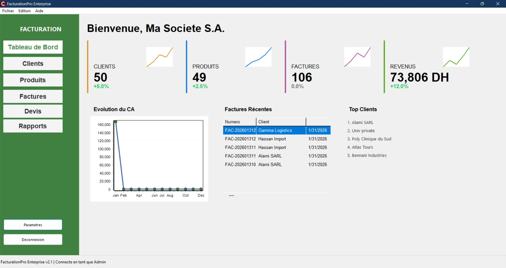
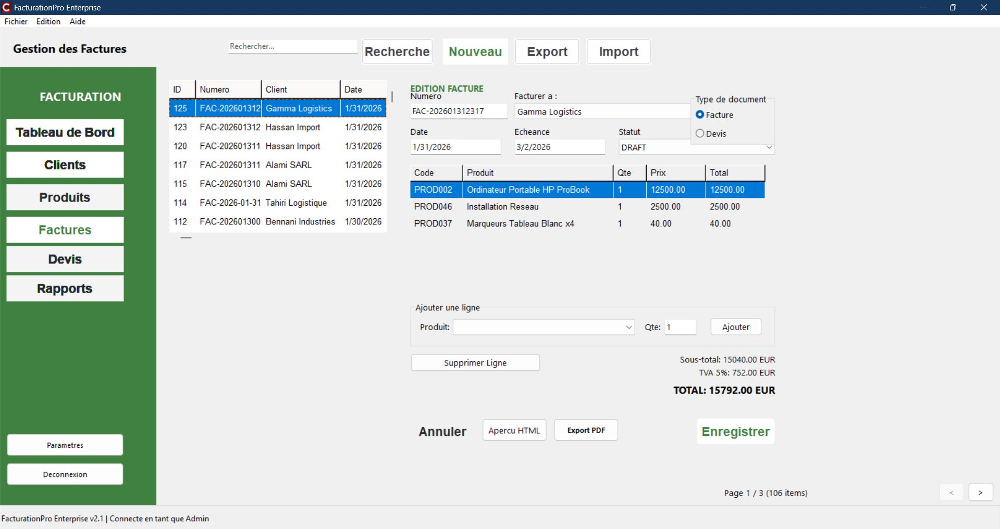

# FacturationPro Enterprise

> Windows desktop billing & invoicing system — C++ / Delphi VCL frontend, SQLite backend. Multi-user, role-based, prints PDF invoices, tracks clients and stock. Built for small-to-medium businesses that prefer a real installable Windows app over a SaaS web form.


> **This is not an open-source project.** This repository is a portfolio mirror — it contains snapshots of UI work, schema design and selected code, *not* the buildable source. The full application is private.

## What it does

A standalone Windows app that handles the full small-business invoicing loop: clients → quotes → invoices → payments → stock movement → tax-ready reports. Eight modules, one SQLite file, one installer.

| Module | Purpose |
|---|---|
| Dashboard | Today's revenue, top clients, low-stock alerts, KPIs |
| Clients | CRUD, history, balance per client |
| Articles | Catalogue + stock + low-stock thresholds |
| Quotes | Generate, edit, convert to invoice |
| Invoices | Multi-line, taxes, discounts, PDF export |
| Payments | Partial payments, reconciliation |
| Reports | Revenue / TVA / outstanding balance, exportable |
| Settings | Company info, tax rates, users + roles |

## Why a desktop app in 2026

Three reasons I picked C++ / VCL / SQLite over a Next.js + Supabase setup:

1. **The customer profile.** Small Moroccan businesses overwhelmingly want a thing they double-click that runs without the internet. Cloud SaaS means a monthly fee in a market that doesn't price-tolerate them.
2. **Local data ownership.** A single SQLite file, on the customer's machine, backed up to a USB stick. No data leaves the building.
3. **Engineering interest.** Doing real OOP in modern C++ on Windows is a different skill from React+Tailwind, and worth keeping sharp.

## Architecture

```
┌────────────────────────────────────────┐
│        UI layer (VCL)                  │
│  TFrame-based forms · custom controls  │
│  ModernButton · ModernKPICard          │
└──────────────┬─────────────────────────┘
               │
┌──────────────▼─────────────────────────┐
│        Domain layer                    │
│  Client / Article / Invoice            │
│  PDFInvoiceGenerator · TaxCalculator   │
└──────────────┬─────────────────────────┘
               │
┌──────────────▼─────────────────────────┐
│        Persistence (FireDAC + SQLite)  │
│  Repositories per aggregate            │
│  Schema migrations on boot             │
└────────────────────────────────────────┘
```

## Screenshots





## Stack

- **C++** with Embarcadero RAD Studio (VCL framework).
- **SQLite** for storage (file-based, zero config, works offline).
- **FireDAC** for ORM-style data access + migrations.
- **A small custom UI kit** (`ModernButton`, `ModernKPICard`, `ModernTable`) on top of VCL — the shipped app doesn't look like a 2007 Borland demo.

## Roadmap (honest)

- [x] v1 — single-user, full invoicing loop, PDF export.
- [x] v2 — multi-user with roles, per-client balances, low-stock dashboard.
- [ ] v2.1 — editable in-grid invoice lines, smarter low-stock alerts.
- [ ] v2.2 — automatic backup to USB / network share on close.

Long-term ideas (no commitment yet): PostgreSQL backend for multi-site, REST layer for a web companion, multi-currency. These are interesting, not promised.

## Why this repo is private

The active customers using this software pay for it. Open-sourcing it would undercut them and me. The mirror here exists to:

- Show the architecture and quality of the code.
- Show the UI, with screenshots.
- Show that the developer behind it is contactable for tailored builds.

For licensing, custom builds, or to talk shop: yassirzahidi8@gmail.com.

— Yassir Zahidi · Rabat, Morocco · [portfolio](https://y-zahidi.github.io) · [linkedin](https://www.linkedin.com/in/yassir-zahidi/)
