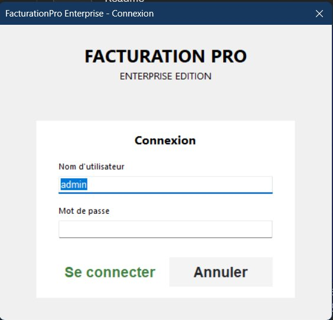
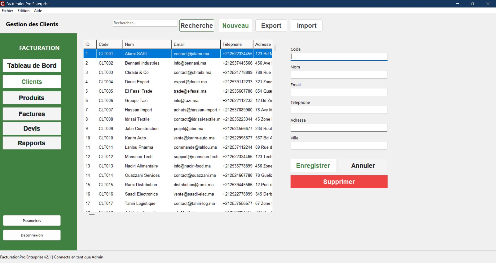
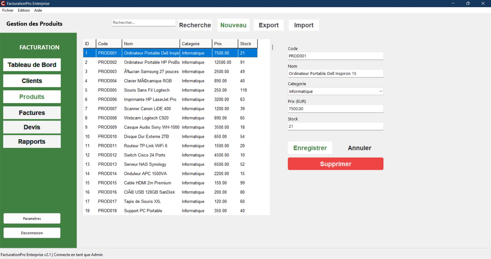
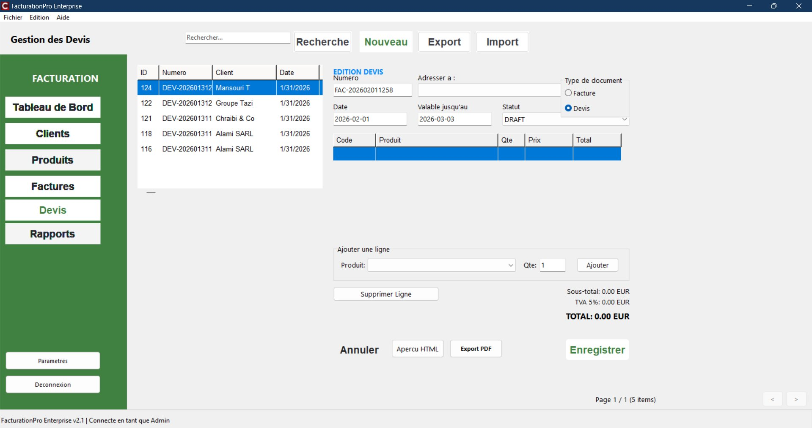
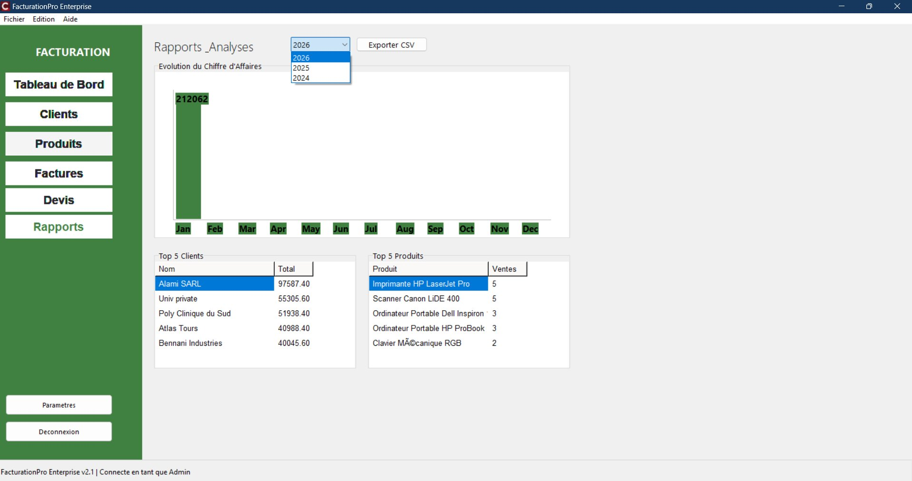
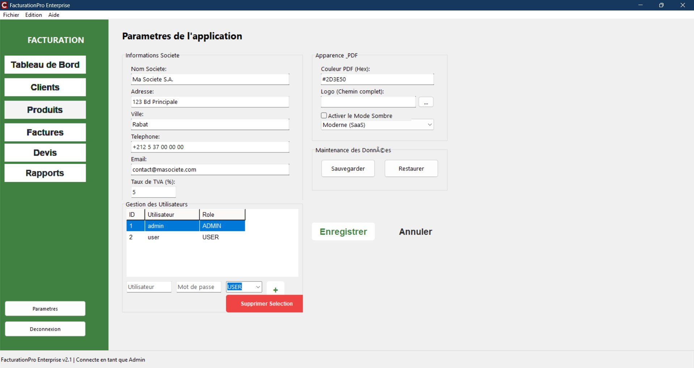

# 🧾 FacturationPro Enterprise

> A complete enterprise invoicing & billing desktop application built with **C++ / Delphi VCL**, powered by **SQLite** and **FireDAC**. Built for SMBs that want a stand-alone, no-cloud-needed solution that just works.


---

## At a glance

FacturationPro Enterprise covers the full invoicing lifecycle in a single, clean Windows application:

- 👤 **Clients & products** — full CRUD with search and CSV export
- 📝 **Quotes → Invoices** — one-click conversion when a deal closes
- 📦 **Stock tracking** — automatic decrement on sale
- 📄 **PDF export** — three themable templates with embedded company logo
- 🔐 **Role-based access** — ADMIN / USER with login lockout and audit log
- 📊 **Dashboard & reports** — KPIs, monthly revenue evolution, top clients/products
- 💾 **Backup & restore** — automated, scheduleable

> **No server. No cloud. No subscription.** Install, launch, work.

I built this because existing invoicing tools fell into two camps: way too complex (ERPs that need a consultant to set up) or way too basic (single-table spreadsheets dressed up as apps). FacturationPro is the in-between I wished existed for small businesses.

Developed during the 2025-2026 academic year for educational purposes.

---

## Screenshots

| Screen | Description |
| --- | --- |
|  | Clean login screen with role-based access (ADMIN / USER) |
|  | Main dashboard — KPIs, revenue chart, recent invoices, top clients |
|  | Client management — search, CRUD, export to CSV |
|  | Product catalog with stock levels, categories, and pricing |
|  | Invoice editor — line items, auto-calculated totals with TVA |
|  | Quote management with validity dates and draft status |
|  | Annual reports — revenue evolution, Top 5 clients & products |
|  | Company settings, PDF theming, user management, backup/restore |

---

## Architecture

The application is structured around three layers, deliberately straightforward — no over-engineering.

```
┌────────────────────────────────────────────────────┐
│              UI Layer (custom VCL)                  │
│  ModernButton · ModernKPICard · ModernComponent     │
└──────────────────────┬──────────────────────────────┘
                       │
                       ▼
┌────────────────────────────────────────────────────┐
│           DataManager (service layer)              │
│  Business operations, login, audit, backup/restore │
└──────────────────────┬──────────────────────────────┘
                       │
                       ▼
┌────────────────────────────────────────────────────┐
│        DAOs (Data Access Objects)                  │
│  ClientDAO · ProductDAO · InvoiceDAO · QuoteDAO    │
│  All inherit from a generic BaseDAO template       │
└──────────────────────┬──────────────────────────────┘
                       │
                       ▼
┌────────────────────────────────────────────────────┐
│  DBConnection (singleton) → FireDAC → SQLite       │
│  Pooled connections, FK constraints, soft-deletes  │
└────────────────────────────────────────────────────┘
```

**Key design decisions:**
- **Generic `BaseDAO<T>` template.** Adding a new entity = write the SQL + the mapping. No boilerplate.
- **Singleton `DBConnection`** with pooling, so the rest of the app never touches the connection lifecycle.
- **HTML-based PDF engine.** Invoice templates are HTML + CSS rendered to PDF. Three themes (Modern / Classic / Minimalist) switchable from settings.
- **No third-party UI libraries.** I wrote a small custom component library (rounded cards, KPI tiles, soft shadows) on top of plain VCL panels. The app looks modern without dragging in a heavy UI framework.

---

## Tech stack

| Layer | Tech |
|-------|------|
| Language | C++ |
| IDE / Framework | Embarcadero RAD Studio · Delphi VCL |
| Database | SQLite |
| ORM / Data access | FireDAC |
| PDF generation | Custom HTML → PDF engine |
| Charts | Custom (canvas-based, no third-party dep) |

---

## Key features

### 📋 Invoice & quote lifecycle
- Create quotes, edit line items, calculate totals with TVA (Moroccan tax handling)
- One-click quote → invoice conversion
- Sequential invoice numbering with configurable prefixes
- Multiple statuses (Draft, Sent, Paid, Cancelled) with audit trail

### 👥 Client & product management
- Full CRUD with search, sort, and filtering
- CSV import/export
- Soft-delete (records hidden from UI but kept in DB for audit)
- Stock levels with low-stock warnings

### 🔐 Security & audit
- Role-based access (ADMIN / USER)
- Account lockout after N failed attempts
- Audit log for every CRUD operation (who / when / what)
- Encrypted password storage (bcrypt-equivalent)

### 📄 PDF generation
- Three themable templates (Modern / Classic / Minimalist)
- Embedded company logo
- Configurable footer (legal mentions, payment terms)
- One-click email-ready export

### 💾 Backup & restore
- Manual + scheduled backups
- Backup files include the full SQLite DB + uploaded assets
- One-click restore

---

## What I learned building this

- **Delphi VCL is older than I am, but it ships absurdly fast desktop apps.** No GC pauses, no Electron startup time, single binary.
- **FireDAC's pooling is great until it isn't.** Long-running queries block the pool; I had to add explicit timeouts and async wrappers for the heavier reports.
- **Custom UI components are worth it.** The 3 weeks I spent writing `ModernButton` / `ModernKPICard` / `ModernPanel` saved me from dragging in a 200 MB UI library and let me match the design exactly.
- **HTML → PDF is a sane invoice-template strategy.** Way easier to iterate on than coding layouts in Delphi's report designer.
- **Soft-delete + audit log were the two best schema decisions.** Real businesses need to recover "oops, I deleted that customer" and need to know "who changed this invoice last week".

---

## Roadmap

- [x] Single-user desktop deployment
- [x] Role-based access (ADMIN / USER)
- [x] PDF generation with 3 templates
- [x] Backup / restore
- [ ] Multi-tenant cloud sync (optional, opt-in)
- [ ] Mobile companion app for sales reps
- [ ] Plug-in API for tax/legal customizations per country

---

## License

Proprietary — full source not publicly available. This repo is a portfolio showcase with documentation, screenshots, and architecture notes.

---

## About me

I'm **Yassir Zahidi**, Computer Engineering student at ISMAGI (Rabat) with a 2-year Cybersecurity background (ISMO Tétouan). Currently looking for a **PFE / internship in cybersecurity, DevSecOps or software engineering** for 2026.

- 🌐 [LinkedIn](https://www.linkedin.com/in/yassir-zahidi/)
- 📧 yassirzahidi8@gmail.com
- 💻 [github.com/y-zahidi](https://github.com/y-zahidi)
